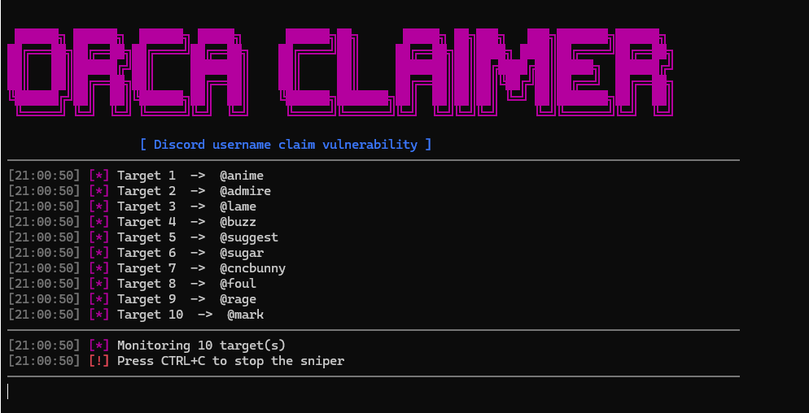

<div align="center">


# Orca Username Claimer
**Orca Claimer is a proof-of-concept demonstrating a  Discord username allocation flaw that exposes exact release timestamps and grace-window metadata.**


Using this timing leak, Orca synchronizes claim attempts to the precise millisecond a username is released—without constant availability polling.

---


## What this tool contains

* **Multi-username monitoring** — Track multiple targets simultaneously.
* **Multi-token support** — Pair accounts with individual usernames.
* **Low-latency core** — Optimized to reduce request and processing overhead.
* **JA3 fingerprinting** — Supports customizable TLS client fingerprints.
* **Concurrent claiming** — Processes multiple claim targets independently.
* **QUIC/UDP transport** — Uses the project’s low-latency transport layer where supported.
* **Grace claiming** — Dynamically calculates simulated release timing and schedules claims around the exact release window.
* **Lightweight** — Minimal dependencies, fast startup, simple configuration.


---
</div>

<div align="center">
  
</div>

## Installation

```bash
git clone https://github.com/zephyrcore/discord-username-sniper.git
```
```bash
cd discord-username-sniper
```
```bash
npm install
```

OR ( auto setup )

```bash
setup.bat
```

## Configuration

### 1. Add accounts

Add your account credentials to `tokens.txt` using the following format:

```txt
TOKEN:PASSWORD
TOKEN2:PASSWORD2
TOKEN3:PASSWORD3
```

### 2. Add target usernames

Add the usernames you want to monitor to `usernames.txt`, one username per line:

```txt
username
anotherusername
thirdusername
```

> **Important:** The number of tokens must match the number of usernames. Each account is paired with the username at the corresponding line number.

For example:

```txt
# tokens.txt
TOKEN_A:PASSWORD_A
TOKEN_B:PASSWORD_B
```

```txt
# usernames.txt
username_a
username_b
```

`TOKEN_A` monitors `username_a`, while `TOKEN_B` monitors `username_b`.

## Usage

Start the claimer with:

```bash
node index.js
```

The process will begin monitoring the configured usernames and attempt a claim when an availability change is detected.


---

## Why the Timing Leak Matters

A conventional availability monitor behaves roughly like this:

```text
CHECK ── wait ── CHECK ── wait ── CHECK ── CLAIM
```

That creates uncertainty between the final failed check and the first successful one.

The fictional timing oracle changes the flow:

```text
LOOKUP
  │
  ├── release_at_ms = 1790091784127
  │
  ├── synchronize local clock
  │
  ├── warm claim path
  │
  └── sleep until release window
                │
                ▼
        1790091784127
                │
             CLAIM
```

No aggressive polling is needed in the simulation. Orca schedules against the timestamp supplied by the fictional service.

---

## Security

`tokens.txt` contains sensitive account credentials.

Do **not** commit or publish this file. Add credential/configuration files containing secrets to `.gitignore` where appropriate:

```gitignore
tokens.txt
```

Avoid sharing Discord tokens, passwords, session credentials, or other authentication material with anyone.

## Disclaimer

This project is provided for educational and experimental purposes.

Automated account actions, unofficial API usage, fingerprint manipulation, or attempts to circumvent platform protections may violate Discord's Terms of Service or result in account restrictions. You are responsible for how you use the software and for complying with applicable platform rules.
